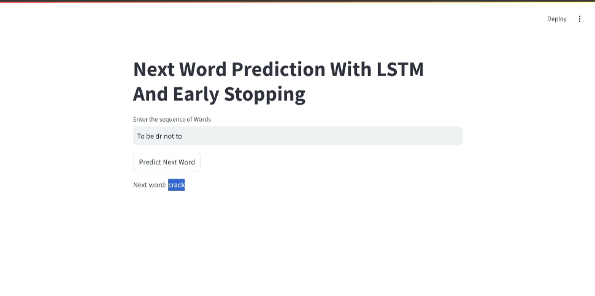

# Next-Word-Prediction-with-LSTM

This project utilizes an LSTM model to predict the next word in a sequence, trained on Shakespeare's *Hamlet*. The model is deployed via a user-friendly Streamlit interface, where users can input text and receive real-time predictions.

### Features:
- **Real-time word prediction**: Input a sequence of words and predict the next word.
- **Streamlit interface**: Easy-to-use interface for experimenting with word prediction.
- **Early stopping**: To avoid overfitting during model training.

## Demo
Below is a screenshot of the app in action:



## How It Works
- Users input a sequence of words (e.g., "To be or not to") into the Streamlit app.
- The trained LSTM model processes the input and predicts the next word.
- The predicted word is displayed in real time.

## Installation

1. Clone the repository:
    ```bash
    git clone [https://github.com/yourusername/Next-Word-Prediction-with-LSTM.git](https://github.com/punithkumar-10/Next-Word-Prediction-with-LSTM-using-Stremalit)
    cd Next-Word-Prediction-with-LSTM
    ```

2. Install the required dependencies:
    ```bash
    pip install -r requirements.txt
    ```

3. Run the Streamlit app:
    ```bash
    streamlit run app.py
    ```

## Requirements

The project requires the following dependencies:
- TensorFlow 2.15.0
- Streamlit
- Pandas
- Numpy
- Scikit-learn
- Tensorboard
- Scikeras

## Model
The LSTM model is trained using TensorFlow and is loaded in `app.py` to make predictions based on user input. The tokenizer used to preprocess the text data is also loaded to ensure consistent results.

## License
This project is licensed under the MIT License - see the [LICENSE](LICENSE) file for details.
